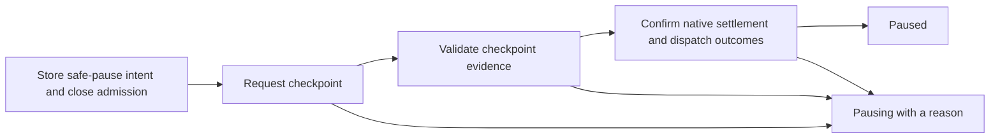

# Unit 4 lifecycle proposals

Status: proposed for review, September 13, 2026. These proposals supplement execution-contracts.md revision 4; they do not change runtime behavior or represent completed implementation. The current control implementation and its verification remain described in unit-4-controls.md.

The existing contracts already determine authority, immutable briefs, stale-revision rejection, durable launch intent, terminal cancellation, inherited stop boundaries, and finite execution limits. The proposals below make the missing evidence and decision formats concrete. They require no additional access or implementation authorization. The policy choices at the end are recommendations for review.

## 1. Safe pause: recorded checkpoint followed by confirmed native settlement

**Recommendation:** safe pause requests a durable account of unfinished work. By default it permits writing checkpoint metadata and artifacts to Marionette's artifact store only. It does not request a Git commit, cleanup, publication, or changes to project files. Additional checkpoint writes must be explicitly listed and already authorized by the current brief; safe pause cannot grant permission.

A checkpoint is a record of retained work, not proof that it is correct or complete. It contains completed observations, unfinished actions, workspace state, retained effects, and concrete continuation instructions. Existing edits remain in place. Copying an artifact does not change ownership of the original workspace.

### Request and acknowledgement

A safe-pause request uses the same workflow/control revision checks and atomic descendant admission fence as now/drain pause. Each affected active attempt gets an immutable checkpoint request containing:

- Control intent ID, attempt ID, brief revision, control revision, session generation, and native identity generation.
- A deadline no later than the attempt's existing deadline.
- Explicit allowed final-write paths/actions and their existing authority references; an empty project-write list is the default.
- A checkpoint artifact schema version and a single-use acknowledgement token bound to that attempt and control.
- The originating attempt ID plus the exact append-only native-session-reference observation IDs and native-history observation IDs used to describe the checkpointed conversation. Missing or unconfirmed native identity stays explicit.

The assigned worker submits `checkpoint.record` with that envelope, artifact digests, retained-effect records, pending-operation references, and continuation notes. The runner checks the authenticated worker identity, current revisions, artifact availability and digests, and declared write scope. A worker acknowledgement remains a claim about its work; it does not establish compliance or native settlement.

Every checkpoint artifact link is provenance-bearing: it names the checkpoint record, originating attempt, result when applicable, artifact digest, and the exact typed native reference/history observations. A fresh attempt may discover those retained links, but does not inherit the prior native conversation or its authority. This paragraph specifies the future safe-pause evidence shape only; it does not implement safe pause.

Retained effects use a discriminated record: `workspace-change`, `git-change`, `external-operation`, or `none-observed`. Each record identifies its target, evidence references, and status (`confirmed` or `unconfirmed`). A `none-observed` assertion includes the checks supporting it. Unknown effects cannot be relabelled as absent.

Native settlement is separate evidence: the adapter must verify the recorded session identity, observe settlement after checkpoint acknowledgement, and account for dispatches already admitted. Checkpointing is a narrowly scoped managed effect allowed under this specific control intent; other new managed effects remain fenced. An ambiguous checkpoint delivery is never replayed automatically.

### Failure and race rules

- If no native work was launched, close the pending attempt without requiring a worker checkpoint.
- An already settled attempt retains its existing result/effects; safe pause does not relaunch it to obtain a checkpoint.
- An active adapter that cannot support checkpoint acknowledgement leaves safe pause blocked and admission closed. Report the unsupported capability before acceptance when it is known; a capability failure discovered after acceptance cannot reopen admission.
- Missing acknowledgement, failed digest checks, disconnected identity, or unresolved native dispatch leaves the workflow `pausing`, with a specific blocked/unconfirmed reason.
- Do not silently convert safe pause to drain or immediate pause. The existing attempt deadline still requests interruption when exhausted, but that interruption does not count as a successful safe checkpoint. The caller can explicitly replace safe pause with immediate pause.
- A newer immediate pause or cancellation invalidates checkpoint-write admission immediately. Already admitted checkpoint writes remain in flight until reconciled.
- If every affected active attempt has valid checkpoint evidence and confirmed settlement, complete safe pause. Required evidence survives process and workspace retirement.

**Acceptance tests:** wrong worker/generation/revision fails; acknowledgement without native settlement cannot pause; idle without acknowledgement cannot pause an active safe-pause attempt; a later cancellation fences checkpoint writes; crash after checkpoint dispatch does not replay it; unsupported capability and timeout keep the stop intent visible.

## 2. Resume: explicit continuation decision, using a fresh attempt

**Recommendation:** resume reopens a settled pause and records what may happen next. Any further worker execution starts a fresh attempt and session with a consolidated current brief. It never resumes the prior native turn or repeats its mutations implicitly. This costs a new attempt but avoids confusing old permissions and instructions with new authority.

A paused workflow need not run a worker immediately: it may instead evaluate retained results or await a permitted transition. Resume and result acceptance remain separate operations.

### Replace the untyped decision

Replace `ResumeWorkflowInput.decision: unknown | null` with a strict decision union. All variants include a reason, expected workflow/brief/control/limits revisions, the exact pause intent being released, workspace observation references, and an idempotency key.

| Decision | Required evidence | Result |
| --- | --- | --- |
| `evaluate-retained-results` | Exact result IDs and their current brief/evidence references | Reopen for an explicit result decision and permitted transition; create no attempt |
| `start-fresh-attempt` | Current step-run ID, checkpoint/result references, consolidated brief revision, retained-effect dispositions, and workspace observations | Reopen and atomically admit one fresh attempt for that step execution |

A failed step/workflow is terminal and cannot use resume as retry. An interrupted attempt with an unfinished step can use `start-fresh-attempt`; repeating an already completed step requires an explicit permitted repeat transition and a new step execution.

Each retained effect is addressed explicitly as `preserve`, `already-reconciled`, or `requires-new-work`. `already-reconciled` requires evidence of the actual resulting state. `requires-new-work` names the authorized future work; it does not authorize rollback or cleanup. Every recorded unconfirmed operation must first be resolved by a separate reconciliation record with positive sender/effect evidence. “Proceed anyway” is not a decision variant.

### Admission rules

In one transaction, validate that the pause is the current effective stop, all relevant prior attempts and admitted effects are settled, the current brief and permissions remain applicable, the workspace observations are current under the cooperating writer reservation, and limits remain available. Record the decision and increment workflow/control revisions. For fresh work, also reserve capacity, consume an attempt allowance, and store launch intent. A later launch claim repeats the applicable revision and workspace checks before dispatch.

Workspace observations include host/workspace identity and, for Git work, HEAD, index and working-tree evidence; unrestricted concurrent writers remain outside the reservation guarantee. An unexpected change rejects the decision rather than causing a reset or automatic conflict resolution.

A boundary change, permission expansion, brief change, or limit extension is a separate authorized revision before resume. Resume cannot release a design-only boundary by itself. Cancellation always rejects resume.

### Descendant stops

Record which control intents still restrict each workflow. Resuming an ancestor removes only the restriction created by the named ancestor pause. A child-specific pause remains effective; a child cancellation remains terminal. A root resume decision includes explicit per-child continuation decisions for descendants it intends to restart. An omitted child stays paused, even if its ancestor is running again. Unknown or omitted child state is never permission to launch it.

**Acceptance tests:** stale resume loses to a later stop; cancellation never resumes; retained results are not automatically accepted; workspace drift rejects fresh launch; unresolved dispatch prevents resume; a fresh attempt records the current brief; resuming a parent cannot clear a child's independent stop; a crash after resume admission cannot duplicate the attempt.

## 3. Managed children: inherited restrictions and shared ancestor accounting

**Recommendation:** child routing is a permitted workflow transition. In authenticated workflow context the parent comes from the session, not a caller-supplied optional field. Child admission atomically creates the relationship and initial execution intent. Every child attempt consumes one allowance from the child and every ancestor; no separate lump-sum child budget is preallocated.

### Admission envelope and transaction

A child route request includes the source step-run ID, exact pinned child package digest, current parent workflow/brief/control/limits revisions, input result IDs, proposed child brief and workspace, reason, and idempotency key. An external controller explicitly identifies the parent and must have authority over it. A worker cannot evade its inherited parent through a direct admission operation.

Within one SQLite transaction:

1. Verify the actor, session-derived parent, source step execution, permitted route, pinned package, input evidence, and all ancestor restrictions.
2. Derive effective child restrictions and reject any request that exceeds them. Do not silently reinterpret contradictory instructions.
3. Check deadlines, attempt/repeat allowances, review separation, and capacity across the full ancestor chain.
4. Create the child workflow, immutable initial brief, input dependency edges, parent relationship, first step execution, first attempt/reservation, and durable launch intent. Debit attempt allowances once in this transaction.
5. Return a stable receipt. Retry with the same payload returns those same identities.

If admission commits first, a subsequent stop or brief revision discovers the registered child and covers it. If stop/revision commits first, admission fails stale. No native launch occurs before commit. Creating a child record with no launch does not substitute for this admission operation.

### Inheritance rules

| Restriction | Child rule |
| --- | --- |
| Host/project | Must match; paths are interpreted on that host |
| Scope and ownership | Explicit subset or authorized delegated portion of parent scope; overlapping write ownership requires a cooperating reservation |
| Permissions and user constraints | Inherit as structured restrictions with provenance; a child can narrow them, never broaden them |
| Stop boundaries | Inherit the strictest effective ancestor boundary; design-only cannot route to implementation |
| Brief and result dependencies | Record exact consumed revisions/results; parent revision invalidation follows those edges |
| Review separation | Apply across the relevant parent/child work; a child reviewer cannot be the implementer under another workflow identity |
| Deadline | Earliest of the requested child deadline, package deadline, and all ancestor deadlines |
| Parallelism | Every unsettled admitted descendant attempt occupies a slot in its own workflow and every ancestor |

Free-text constraints remain visible instructions, but cannot establish a machine-checkable permission subset. Introduce structured fields for host, workspace access, allowed effects, owned paths, and boundary restrictions. Keep free-text constraints alongside them. If a requested scope/ownership transformation cannot be validated, fail admission with the conflicting restriction and require an explicit controller-authored brief; do not infer broader authority from prose.

### Accounting rules

- Charge an attempt once at admission to the child and each ancestor. Do not refund attempts cancelled before dispatch; this keeps the limit a bound on admitted attempts, including repeated launch/cancel cycles. Idempotent replay never charges again.
- Each explicit repeat transition similarly consumes one repeat from its workflow and each ancestor. Retrying an interrupted attempt consumes an attempt, but does not also consume a repeat unless a repeat transition creates another step execution.
- Reservations for pending, running, stopping, or unconfirmed attempts count against parallelism until settlement. Lease expiry does not release capacity.
- A waiting controller with no active attempt consumes no slot. A running parent attempt does consume a slot; it must settle before a child can launch if the shared parallelism limit is one. Do not silently exempt controllers from capacity.
- An extension to a child's local limits cannot exceed an ancestor's limits. An ancestor extension does not automatically extend the child's deadline or limits.
- Parent success does not follow from child success alone: child results go through the required acceptance, review, and handoff gates. Child failure is retained as a failed child execution; parent recovery requires a permitted explicit transition and remaining allowance.
- Truly top-level work created outside managed workflow context remains independent. Raw native sessions remain outside managed scheduling guarantees.

**Acceptance tests:** child admission races stop/revision; nested routes cannot escape design-only or review separation; one remaining ancestor attempt permits only one concurrent admission; replay does not double-charge; unconfirmed children retain capacity; independent top-level work is unaffected; a child extension cannot increase parent allowance; parent result acceptance requires current child dependencies.

## Recommended decisions for review

These are the product-policy defaults proposed above. The evidence schemas, transaction boundaries and race checks are implementation work that follows from them.

1. **Safe pause:** checkpoint metadata/artifacts only by default; additional project writes require an explicit list within existing authority. No automatic fallback on checkpoint failure. Alternative: require explicit allowed checkpoint writes on every request, including an empty list.
2. **Resume:** fresh attempt and native session for further execution; retained-result evaluation can proceed without a worker. Alternative: later support reuse of a settled native session only through a separately proven adapter contract.
3. **Children:** charge each admitted attempt against every ancestor, without refunds; active parent attempts count against shared parallelism. Alternative: reserve fixed child allocations up front, which needs additional transfer/refund rules and can strand capacity.

Recommendation: adopt all three defaults for v1. They preserve the existing boundaries and make failure states explicit without inventing automatic cleanup, authority expansion, or replay behavior.

## Implementation sequence after review

1. Add typed checkpoint/effect evidence, structured restrictions, active stop provenance and decision records through additive migrations; keep immutable history.
2. Implement independent brief revision and limit revision operations with dependency invalidation and authorization checks. Existing execution-contract rules govern these; the proposals do not hold up unrelated defined work.
3. Implement checkpoint admission and settlement guards. In particular, the current generic settlement path must no longer confirm safe controls without checkpoint evidence.
4. Implement atomic resume decisions and child admission with ancestor accounting, followed by permitted transitions and their evidence gates.
5. Verify with real SQLite concurrency/process-loss tests, actual native socket fixtures and built CLI/SDK parity checks. Report live native acceptance separately; fixtures cannot prove live checkpoint or session compatibility.

No runtime code or accepted execution contract was changed to implement these proposals.
